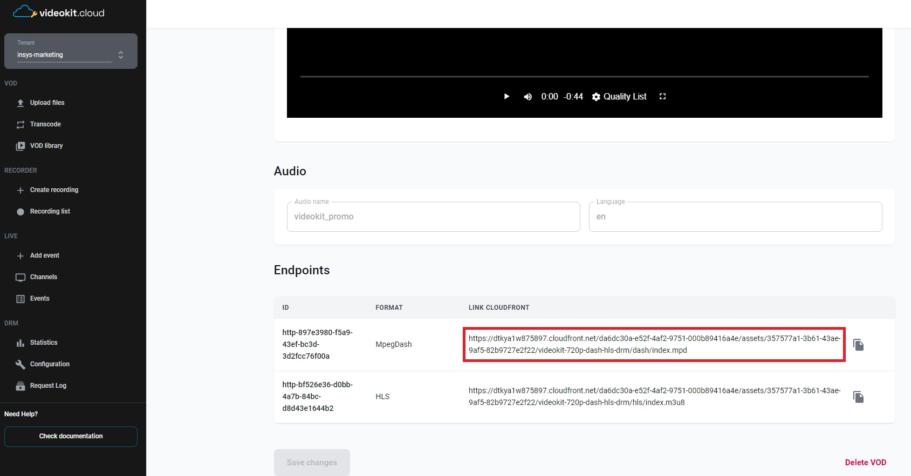
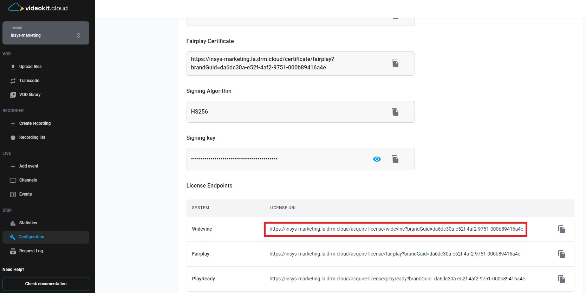

# Bitmovin Player with Cloud DRM in Kotlin or Java

This project demonstrates how to implement DRM (Digital Rights Management) playback in an Android application using both Kotlin and Java programming languages with the Bitmovin Player.

## Overview

The MainActivity class in this project showcases the setup and usage of the Bitmovin Player for DRM playback. It initializes the player, configures the media source, DRM settings, and handles the lifecycle of the player view.

## Prerequisites

  - Android Studio installed
  - Knowledge of Kotlin and Java programming languages
  - Obtain the Bitmovin Player SDK and license key from the Bitmovin dashboard (https://dashboard.bitmovin.com/player/licenses) and follow their instructions for integration.
  - Access to Cloud DRM (via Cloud Video Kit web console) to obtain: 
    - `URL` - The url to the MPEG-DASH manifest of the video
     
    
    - `DRM_LICENSE_URL` - License server url | 
    
    - `x-drm-brandGuid` - Tenant ID in the Cloud Video Kit | 
    
    - `x-drm-userToken` - A token that allows you to issue a license to play drm material. <br>[More information about the structure of the token and how to generate it can be found here](https://developers.drm.cloud/licence-acquisition/licence-acquisition) 
    ```json
    {
      "exp": 1893456000, 
      "drmTokenInfo": {
        "exp": "2030-01-01T00:00:00+00:00", 
        "kid": ["1f83ae7f-30c8-4ad0-8171-2966a01b6547"], 
        "p": { 
          "pers": false 
        }
      }
    }
    ```

## Getting Started

1. Clone the repository or download the source code.
2. Open the project in Android Studio.
3. Replace the `URL` and `DRM_LICENSE_URL` constants in MainActivity with the actual media URL and DRM license server URL based on your chosen programming language (Kotlin or Java).
4. Set the `x-drm-brandGuid` and `x-drm-userToken` headers in the `httpHeaders` map in MainActivity. Replace the placeholder values with your specific tenant identifier and authorization token for the DRM licensing process.
5. Obtain the Bitmovin Player SDK and license key from the Bitmovin website (https://bitmovin.com) and follow their instructions for integration.
6. In the AndroidManifest.xml file, locate the `<application>` section and add the following meta-data entry:
    ```xml
    <meta-data
      android:name="BITMOVIN_PLAYER_LICENSE_KEY"
      android:value="--Your-Key--" />
    ```
    Replace `--Your-Key--` with your actual Bitmovin Player license key.
7. Allow-list your package names for your player license: Log in to [https://bitmovin.com/dashboard](https://bitmovin.com/dashboard), navigate to `Player -> Licenses`, and add the following package names of the sample applications as allowed domains:
   - `com.insys.player.bitmovin.drm.kotlin.drmplaybackkotlin` (for Kotlin version)
   - `com.insys.player.bitmovin.drm.java.drmplaybackjava` (for Java version)
  This step ensures that your license key is valid for your specific package names.

8. Build and run the application on an Android device or emulator.

## Usage

1. Launch the application on an Android device or emulator.
2. The player view will be displayed, and the media playback will start automatically.
3. The player view supports standard media playback controls like play, pause, seek, and stop.
4. To handle the player's lifecycle, the player view is automatically managed in the MainActivity class. It starts, resumes, pauses, stops, and destroys the player view based on the activity lifecycle events.

## License

This project is licensed under the [MIT License](LICENSE).

## Acknowledgements

- Bitmovin Player: https://bitmovin.com/player
- Bitmovin Documentation: https://bitmovin.com/docs/player
